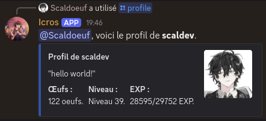

# Icros

Icros is a server-specific, general-purpose Discord app offering:
- a **Profile** system: `/profile`, `/aboutme`,  `/daily`, `leaderboard`, `/give`, `/edit` ;
- a **Shop** system: `/shop`, `roles` ;
- a **r/place-style game:ùù `/place`.

The following sections describe each feature in more detail.

# I. Profile System

## 1. Profile

Each member has a unique profile stored in an SQL database, which includes:
- a customizable "About Me" section, editable with the `/aboutme` command
- a currency balance, represented as eggs
- experience points and levels, earned by sending messages

Members are notified via a message from Icros when they level up.

***Fig. 1.** `/profile` command.*

## 2. Daily reward

Once a day, members can use the `/daily` command to claim a reward consisting of eggs and experience points.
For every consecutive day a member claims their reward, an additional moon lights up. The more moons are lit, the better the rewards. After seven days in a row, the streak resets to the base reward cycle.

***Fig. 2.** `/daily` command.*

## 3. Leaderboard

The `/leaderboard` command displays rankings for eggs, experience points, or daily streaks, from highest to lowest.

***Fig. 3.** `/leaderboard` command.*

## 4. Give

The `/give` command allows members to transfer eggs to one another.

***Fig. 4.** `/daily` command.*

## 5. Edit

The `/edit` command is reserved for moderators. It allows them to manually edit a member’s profile.

***Fig. 5.** `/edit` command.*

# II. Shop System

The `/shop` command lets members exchange eggs for colored roles.

- Navigate through shop pages using arrow buttons

- Use the select menu to choose roles to preview or purchase

- The cart button shows the current selection, and roles can be removed from it via the select menu

- When ready, members can confirm their purchase by pressing the Confirm button twice (if they can afford it!)

- Press the X button to cancel the interaction

***Fig. 6.** `/shop` command - Roles aisle and cart.*

## III. The "Place" Game

The `/place` game is inspired by Reddit’s r/place. Players click buttons to claim them and earn points every 5 seconds per owned button.

Once a button is claimed, the player enters a cooldown period before they can act again.

To succeed, players must form alliances, betray others, steal control—and above all, stay active.

***Fig. 7.** The place game*

